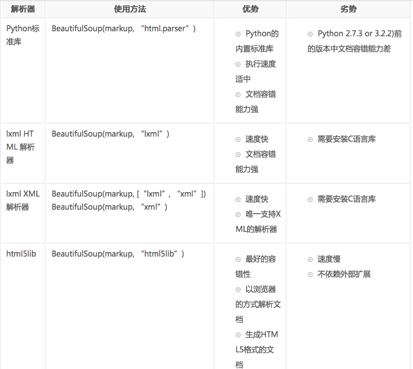
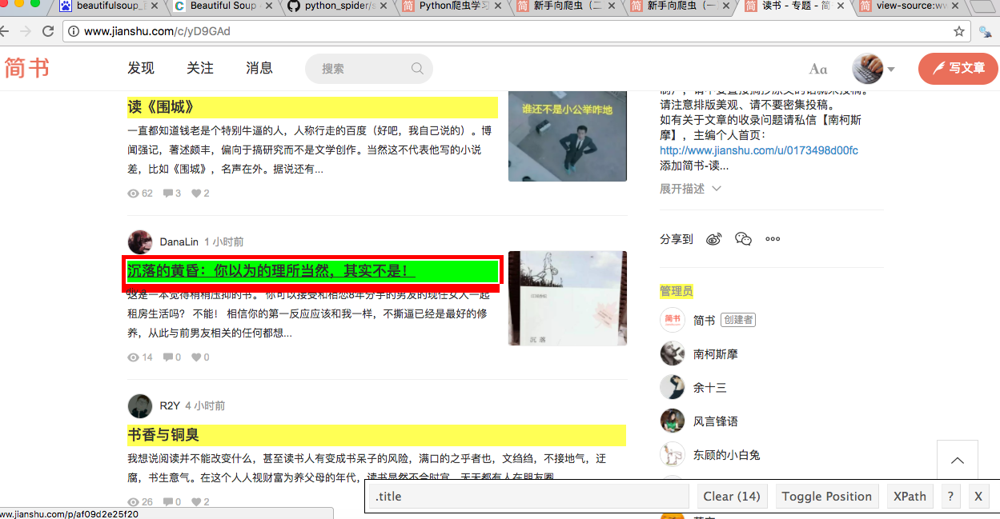

<a href="../README.md" name="top"><<返回目录</a>

# Beautiful Soup

>`Beautiful Soup`-借助网页的结构和属性等特性来解析网页的工具，有了它我们不用再去写一些复杂的正则，只需要简单的几条语句就可以完成网页中某个元素的提取。

### 一. 文档

[官方文档](https://www.crummy.com/software/BeautifulSoup/)

[中文使用文档](https://www.crummy.com/software/BeautifulSoup/bs4/doc/index.zh.html)

### 二. 安装

安装bs4以及lxml:   

```sh
pip install beautifulsoup4
pip install lxml

```
lxml是beautifulsoup的一个依赖库，解析更加强大，速度更快。

### 三. 用法

#### 1. 基本用法

```python
#coding=utf-8
from bs4 import BeautifulSoup

classTest = '<b class="boldest strikeout" name="test_name" id="haha">Extremely bold</b>'
soup1 = BeautifulSoup(classTest, "lxml")
print(soup1.text)
```
输出：

```
Extremely bold
```

**find、find_all**：过滤器

**select**：css选择器

简单使用：

```python
from bs4 import BeautifulSoup

a = """<p class='a b' xixi='123'>haha</p>
<p class='a'>heihei</p>
<div class='a'><p class='c'>ccc</p>aaa</div>
<div class='a b'>xixi</div>"""
soup = BeautifulSoup(a, "lxml")

# --------find_all----------
a = soup.find_all("div")	# 所有div标签
b = soup.find_all("div", "a")	# div标签内class为"a"的子标签
c = soup.find_all("div", class_="a b") # div class='a b'
d = soup.find_all(id="dd") # id='dd'
e = soup.find_all(attrs={"xixi":"123"}) # 标签属性"xixi"="123"
f = soup.find_all(attrs={"class":re.compile("a")})	# 支持正则

# --------select---------
a = soup.select("div")	# 所有div标签
b = soup.select("div.a") # 所有div中class有"a"的标签
c = soup.select("div .a")	# div标签内class为"a"的子标签
d = soup.select("div[class='a b']") # div class='a b'
e = soup.select("div p[class='c'])	# div 标签内 class=c 子标签为p 或子标签的子标签为p

```

#### 2. 解析器



#### 3. 实例
`requests + beautifulsoup + lxml + re` 可以完成很多数据抓取任务。


[Demo 1](https://github.com/JHFighting/python_spider/blob/master/BeautifulSoup/demo_2.py)

抓取某url各个链接

[Demo 2](https://github.com/JHFighting/python_spider/blob/master/BeautifulSoup/sport.py)

获取腾讯体育首页资讯

---


**插件推荐：[SelectorGadget](http://selectorgadget.com/)**

这是一个chrome插件，安装后点击使用，然后直接在你要爬取的网页上选择你要爬取的内容，这时一系列内容会被标黄，这时你所需要的选择器内容就在下方显示出来了，如下图，黄色的标题就被选中，最下面框内即为自动生成的选择器内容。




 [返回顶部](#top)
