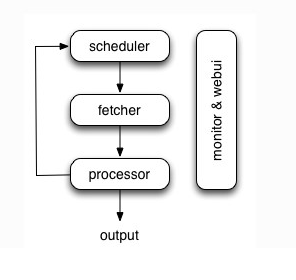
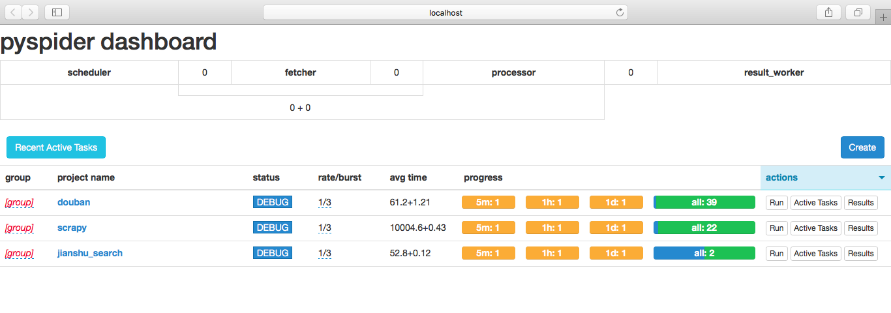
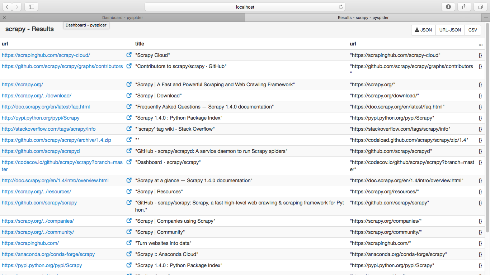
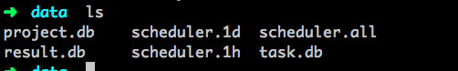

<a href="../README.md" name="top"><<返回目录</a>

# PySpider

## 1. 概念

[PySpider](http://docs.pyspider.org/en/latest/)

[快速入门-中文手册](http://www.pyspider.cn/book/pyspider/pyspider-Quickstart-2.html)

>一个国人编写的强大的网络爬虫系统并带有强大的WebUI。采用Python语言编写，分布式架构，支持多种数据库后端，强大的WebUI支持脚本编辑器，任务监视器，项目管理器以及结果查看器。	

#### 主要特点

* python 脚本控制，可以用任何你喜欢的html解析包（内置 pyquery）
* WEB 界面编写调试脚本，起停脚本，监控执行状态，查看活动历史，获取结果产出
* 数据存储支持MySQL, MongoDB, Redis, SQLite, Elasticsearch; PostgreSQL 及 SQLAlchemy
* 支持抓取 JavaScript 的页面
* 强大的调度控制，支持超时重爬及优先级设置
* 多任务并行，健全的任务管理机制


#### scrapy & pyspider

`scrapy`是封装了twisted的一个爬虫框架，项目结构比较清晰，其中Item Pipeline决定了数据传输跟保存的结构，而爬虫的核心部分在spider目录下，而爬虫也只需要关系核心的解析规则编写。scrapy框架搭了一个架子，在这框架中其实需要实现的核心功能还是要很多的，但是不需要关心中间件层面的东西了。另外scrapy很方便扩展，因此，是一个很不错的轮子了。   

`pyspider`，这个框架封装了tornado，以及集成了一系列工具，比如lxml, css-selector-help，pyquery，phantomjs等，而且开放的api也相当精简，相当于说，pyspider就是针对新手量身定做的一个框架，类似于scrapy中中间件的东西，这边已经帮你集成好了，所有需要关心的就是你的爬虫规则，甚至爬虫规则都支持单步调试编写，门槛几乎为0了。


#### 架构

`pyspider`的架构主要分为 `scheduler`（调度器）, `fetcher`（抓取器）, `processor`（脚本执行）：



* 各个组件间使用消息队列连接，除了scheduler是单点的，fetcher 和 processor 都是可以多实例分布式部署的。 scheduler 负责整体的调度控制
* 任务由 scheduler 发起调度，fetcher 抓取网页内容， processor 执行预先编写的python脚本，输出结果或产生新的提链任务（发往 scheduler），形成闭环。
* 每个脚本可以灵活使用各种python库对页面进行解析，使用框架API控制下一步抓取动作，通过设置回调控制解析动作。   

	> output部分设计尚未决定，因为希望输出也可以很灵活地进行。现在是在脚本中有一个`on_result`的回调，在里面可以自行实现结果输出。


## 2. 安装运行

### 2.1 安装

```shell
pip install pyspider
```

pip安装，会自动安装pyspider的依赖库，如`lxml`,`pyquery`等，但`phantomjs`需要单独安装。

`phantomjs` 安装：   

1. 下载地址：<http://phantomjs.org/download.html>   
2. 选取系统对应版本下载，这里介绍linux下安装，解压：   

	```
	tar -jxvf phantomjs-2.1.1-linux-x86_64.tar.bz2
	```
3. 为phantomjs下的bin目录配置环境变量。

安装成功后，执行：

```shell
pyspider
```
然后，访问<http://localhost:5000/>访问控制台。如下图：



### 2.2 关于项目（Project）

大多数情况下，一个项目就是你针对一个网站写的一个爬虫脚本。

* 项目是相对独立的但是你可以导入其它项目或其它项目的模块．
* 项目有五个状态:TODO,STOP,CHECKING,DEBUG,RUNNING   
`TODO`- 当一个脚本刚刚被创建时的状态   
`STOP`- 你可以设置项目状态为STOP让项目停止运行   
`CHECKING`- 当一个运行中的项目被编辑时项目状态会被自动设置成此状态并停止运行．   
`DEBUG/RUNNING`- 这两状态都会运行爬虫，但是他们之间是有区别的．一般来说调试阶段用DEBUG状态，线上用RUNNING状态．   
* 爬虫的抓取速度根据网上流行的`token-bucket`来控制.   
`rate`- 每秒执行多少个请求   
`burst`- 设置并发数   
如：`rate/burst = 0.1/3`,这个的意思是爬虫10秒爬一个页面．但是开始时前三个任务会同时时行，不会等10秒，第四个任务爬取前会等10秒。      
* 项目删除：把group设置成delete并把项目状态设置成STOP，24小时后系统会自动删除此项目．

## 3. 基本用法

实例：

```python
# -*- encoding: utf-8 -*-
from pyspider.libs.base_handler import *

class Handler(BaseHandler):
    crawl_config = {
    }

    @every(minutes=24 * 60)
    def on_start(self):
        self.crawl('http://scrapy.org/', callback=self.index_page)

    @config(age=10 * 24 * 60 * 60)
    def index_page(self, response):
        for each in response.doc('a[href^="http"]').items():
            self.crawl(each.attr.href, callback=self.detail_page)

    @config(priority=2)
    def detail_page(self, response):
        return {
            "url": response.url,
            "title": response.doc('title').text(),
        }
```
代码简单分析：  
 
**`def on_start(self)`**   

方法是入口代码。当在web控制台点击run按钮时会执行此方法。

**`self.crawl(url, callback=self.index_page)`**   

告诉`pyspider`哪些ＵＲＬ需要抓取。   
参数`url`：需要被抓取的url或url列表   
参数`callback `：这个参数用来指定爬取内容后需要哪个方法来处理内容 


**`def index_page(self, response)`**   

这个方法获取一个`Response`对象。 `response.doc`是PyQuery对象的一个扩展方法，会调用PyQuery库用返回的内容生成一个PyQuery对象以方便使用，生成对象时默认已经把里面的所有链接格式化成绝对链接，可直接分析使用．。PyQuery是一个类似于jQuery的对象选择器。

**`def detail_page(self, response)`**   

返回一个结果集对象。这个结果默认会被添加到`resultdb`数据库（如果启动时没有指定数据库默认调用sqlite数据库）。你也可以重写`on_result(self,result)`方法来指定保存位置。

更多知识：   
`@every(minutes=24*60, seconds=0)` 这个设置是告诉scheduler（调度器）`on_start`方法每天执行一次。

`@config(age=10 * 24 * 60 * 60)` 这个设置告诉scheduler（调度器）这个request（请求）过期时间是10天，10天内再遇到这个请求直接忽略。这个参数也可以在`self.crawl(url, age=10*24*60*60)` 和 `crawl_config`中设置。

`@config(priority=2)` 这个是优先级设置。数字越大越先执行。

**运行结果**




## 4. 单机部署

### 4.1 pyspider配置

`pyspider`命令执行后，在当前目录会自动生成`data`目录：



* `project.db`: 存储脚本数据
* `result.db`: 存储采集到的数据
* `task.db`: 任务采集过程数据

`pyspider`默认通过sqlite链接数据库，存储数据，下面配置可以结果存储在mysql中。   
创建`config.json`： 

```
{
    "taskdb": "mysql+taskdb://username:password@ip:port/taskdb",
    "projectdb": "mysql+projectdb://username:password@ip:port/projectdb",
    "resultdb": "mysql+resultdb://username:password@ip:port/resultdb",
    "webui": {
        "port": 8888,
        "username": "test",
        "password": "test",
        "need-auth": true
    }
}
```

启动：

```
pyspider -c config.json
```

更多配置选项查看：

```
pyspider --help 
pyspider webui --help
```

### 4.2 supervisor管理

[supervisor](http://supervisord.org)是一个用python写的进程管理工具，可以很方便的用来启动、重启、关闭进程。除了对单一进程的控制，还可以同时启动、关闭多个进程，对程序进行监控，当程序退出时，可以自动拉起程序。

#### 4.2.1 安装配置

通过`easy_install`安装：

```
yum install python-setuptools
easy_install supervisor
```

通过`pip`安装：

```
pip install supervisor
```
生成配置文件：

```
mkdir /etc/supervisor
mkdir /etc/supervisor/conf
```
找到`echo_supervisord_conf`文件，默认在`/usr/bin`下，运行以下命令，输出默认配置项，并重定向到指定配置文件中：

```
/usr/bin/echo_supervisord_conf > /etc/supervisor/supervisord.conf
```

修改`supervisord.conf `:

```                                                              
[include]                                                                                        
files = /etc/supervisor/conf/*.conf
```

在`/etc/supervisor/conf`下，配置需要管理的进程，可以统一配置，也可以每个进程单独配置，方便管理，下面是`pyspider.conf`的基本配置：

```
[program:pyspider]                                                                               
command=/usr/local/bin/pyspider -c /home/pyspider/pyspider/config.json                                 
autorestart=true                                                                                 
autostart=true                                                                                   
user=pyspider                                                                                          
group=pyspider                                                                                         
directory=/home/pyspider/pyspider                                                                      
stderr_logfile=/home/pyspider/pyspider/logs/pyspider_err.log                                           
stdout_logfile=/home/pyspider/pyspider/logs/pyspider.log                                               
```

注释：

* `command `: 启动程序的命令
* `autorestart `: 程序异常退出后自动重启
* `autostart`: 在supervisord启动时自动启动
* `user`, `group`: 开启进程的用户和组
* `stderr_logfile `: 错误日志输出
* `stdout_logfile `: 标准日志输出

#### 4.2.2 启动

```
supervisord -c /etc/supervisor/supervisord.conf
```

查看业务进程是否被拉起：

```
supervisorctl status
```

停止supervisor（子进程也会被停止，也可以针对单个程序进行start，update，restart，stop操作）：

```
supervisorctl shutdown
supervisorctl stop pyspider
```

## 5. 实例

##### [Demo 1](https://github.com/JHFighting/python_spider/blob/master/PySpider/jingdong_phone.py) 

获取京东手机页面价格


##### [Demo 2](https://github.com/JHFighting/python_spider/blob/master/PySpider/taobao_pic.py)

获取淘宝模特资料，图片

##### [Demo 3](https://github.com/JHFighting/python_spider/blob/master/PySpider/nba_player.py)

获取腾讯nba所有球队的球员列表，并写到excel


 [返回顶部](#top)