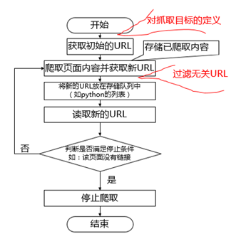

<a href="index.md" name="top"><<返回目录</a>

# 一. 网络爬虫基础

### 1. 概念
网络蜘蛛是通过网页的链接地址来寻找网页，从网站某一个页面（通常是首页）开始，读取网页的内容，找到在网页中的其它链接地址，然后通过这些链接地址寻找下一个网页，这样一直循环下去，直到把这个网站所有的网页都抓取完为止。如果把整个互联网当成一个网站，那么网络蜘蛛就可以用这个原理把互联网上所有的网页都抓取下来。

### 2. 用途 

网络爬虫可以做的事情很多，如以下列出：

* 搜索引擎
* 采集数据（金融、商品、竞品等）
* 广告过滤

其实就我们个人兴趣，学完爬虫我们可以看看当当网上哪种技术图书卖得比较火（销量、评论等信息）、看某个在线教育网站哪门网络课程做得比较成功、看双十一天猫的活动情况等等，只要我们感兴趣的数据，一般的话都可以爬取得到，不过有些网站比较狡猾，设置各种各样的反扒机制。总而言之，网络爬虫可以帮助我们做很多有趣的事情。

### 3. 原理
爬虫就是从种子URL开始，通过 HTTP 请求获取页面内容，并从页面内容中通过各种技术手段解析出更多的 URL，递归地请求获取页面的程序网络爬虫，总结其主要原理如下图：

 [返回顶部](#top)

